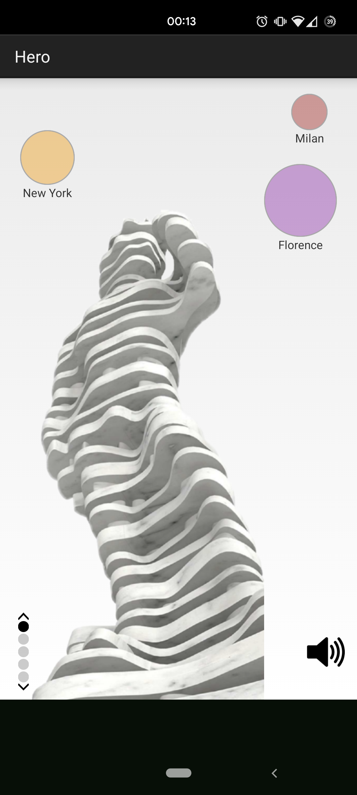
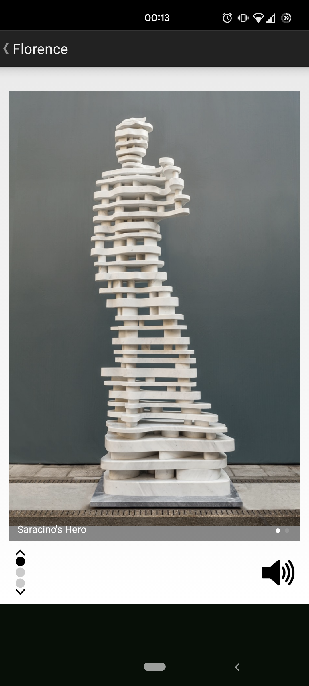
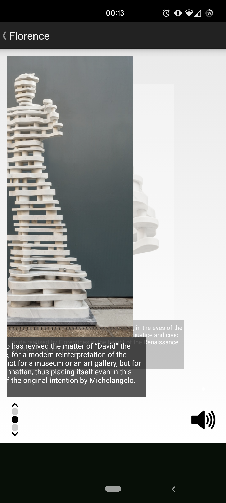
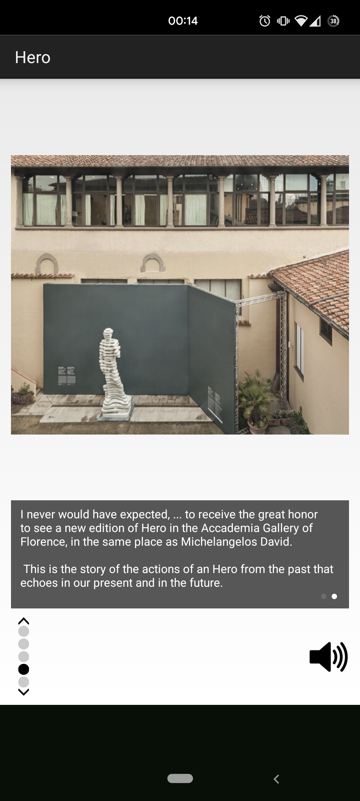
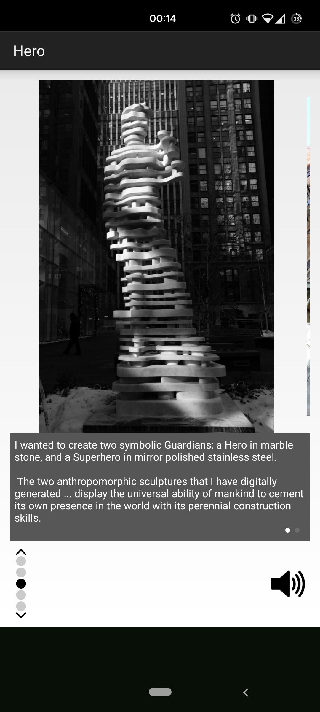
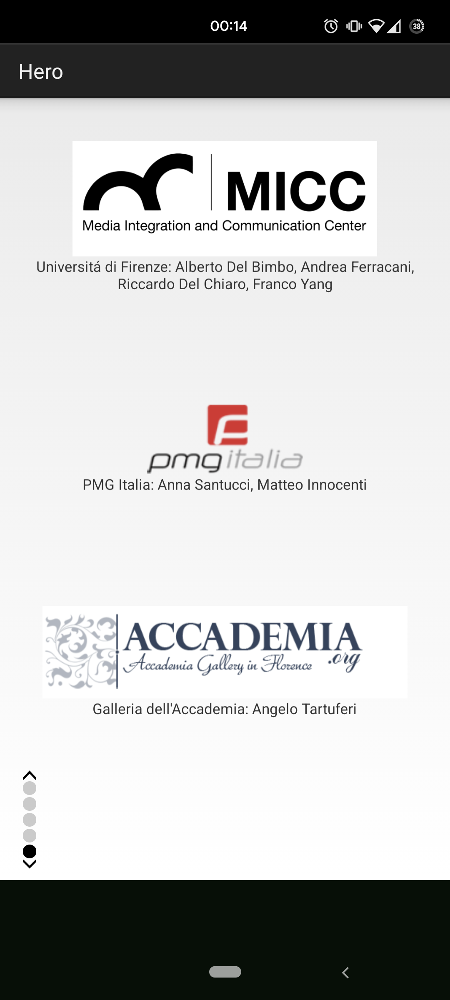

# The Guardians App
*A showcase application for cultural content and expositions.*

This Android app shows how a smartphone can be used to obtain additional information using an innovative interaction:

- A subset of the available content is provided to the user since the first start after installation.
- Additional content is automatically unlocked once the exposition location is reached, thanks to a bluetooth beacon placed at the exposition site.

This show-case was made for the exposition of "The Guardians: Hero" by Antonio Pio Saracino, at Galleria dell'Accademia in Florence (Italy).

  
  
  

  
  
  

http://www.micc.unifi.it/blog/mobile/hero-for-florence
